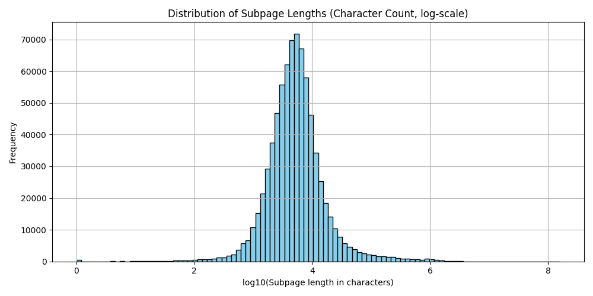

# Datathon 2025 🚀

Team: Rage Against the Machine Learning ❤️ Members: Davide Guidobene, Simone Libutti, Anisha Mohamed, Massimiliano Viola

Orderfox challenge was about designing a RAG agent given raw HTML data. In this report, we explain each step of our workflow in designing the RAG system, summarized in the plot below.


## Setup environment

To run the code, set up a virtual environment and install all required dependencies, like below:

```bash
conda create -n orderfox python==3.11 -y
conda activate orderfox
pip install -r requirements.txt
```

The scripts in the reporitory do the following:
```
data_analysis.py – Preliminary data exploration and basic stats.
preprocess_documents.py – Cleans raw documents, saves a processed dataset version.
embed_documents.py – Generates vector embeddings from preprocessed text using SBERT.
index_bm25_documents.py – Builds a BM25 index for sparse retrieval.
rag.py – Runs the RAG pipeline: retrieval + answer generation.
```

## Data analysis

Before diving into any form of processing, we plotted the logarithms of the subpage lengths in characters and the logarithms of the number of subpages in every URL. We noted the first follows a normal distribution with mean 18316 and that most of the data has below 100 subpages, with an an average of 58.

<p align="center">
  
  
</p>

Based on this observation, we decided to examine the subpages with lengths above 100.000 (corresponding to ~3σ in the log space), finding out that they mostly consisted of CSS and JSON files with no useful content, e.g.:

```json
{
    "source_file": "zondahome.com.json",
    "page_url": "https://zondahome.com/wp-content/themes/zonda/build/main.css?ver=1728577488",
    "char_length": 466801,
    "text": "@font-face{font-display:swap;font-family:Source Sans Pro;font-style:normal;font-weight:300;src:url..."
}
```

A way to remove them is by looking for `css`and `json` in the `page_url`. We also identified many empty subpages of length 0 and pages in languages other than English. 

## Data preprocessing

1. Filtered out `.json` and `.css` files from the dataset, as well as empty strings.
2. Removed non-unicode characters
3. Removed non-alphanumeric characters
4. Removed stopwords 
5. Lowercased 
6. Lemmatized 

Performing these pre-processing steps also greatly improves the size statistics of the final dataset. The average number of characters per subpage goes down to 8166 and the average number of meaningful subpages also decreases to 52.

<p align="center">
  
  
</p>

## Subpage chunk embedding with SBERT🤗

We used `sentence-transformers/all-MiniLM-L6-v2` to embed document chunks of size 1000 characters in vectors of dimension 384. There is a 50% overlap between chunks to ensure some form of semantic continuity. We process ALL the documents and ALL their chunks, for a total of 679473 subpages.

With 22M parameters, the model is blazing fast and memory-efficient, suitable for large-scale indexing with moderate accuracy. To ensure cosine similarity coincides with inner product similarity, we let the model normalize the embeddings.

## Embedding indexing with Faiss

We use Faiss to index our database with an `IndexHNSWFlat` wrapped in `IndexIDMap`. We decided to set `M=64` bi-directional links per node to favor accuracy. Also, we set `efConstruction = 200` for a better quality graph, although slower to build, and `efSearch = 100` for more accurate search results. The final indexed database contains 11.441.872 embeddings.

## BM25 indexing

In parallel with the FAISS-based dense retrieval, we also index the documents using BM25, a well-established ranking function for term-based search. We used the Whoosh search engine library, and chunked documents with a sliding window of 4000 characters and 1000 characters overlap. From experience, we know that BM25 retrieval provides highly complementary results to dmbedding-based methods. While vectors excel at encoding semantic similarity, BM25 often retrieves documents that match specific keywords or rare terms more precisely.

## Retrieval

We combine the index queries with the `BM25` ranking function and pure top-k cosine similarity search using embeddings in the `Faiss` vector database. We first retrieve a few hundred hits from each index that are potentially relevant to the query. The union of these sets of chunks is then passed to a second reranking stage to select the most contextually relevant results for the final response generation.

## Reranking

The retriever is designed to efficiently scan large document collections with millions of entries. However, it might return irrelevant candidates. Reranking with a Cross-Encoder (`ms-marco-MiniLM-L-12-v2`) improves the final retrieval for the generation part of the RAG. If this step fails, the contextual generation will also fail, so investing in the retrieval is important. In reranking, the query and a possible document are passed simultaneously to the transformer network, which then outputs a single score between 0 and 1 indicating how relevant the document is for the given query.

## Augmented generation

We adopt GPT-4o mini and pass in context the relevant documents as well as a carefully engineered system prompt. 
LLM decides whether or not to do RAG based on the user query (for example, the prompt `Hello` should not trigger a retrieval stage). If RAG is triggered, the LLM rewrites the user query in a concise way to optimize the retrieval process and returns either contextualized responses or acknowledges that it cannot answer the question.
